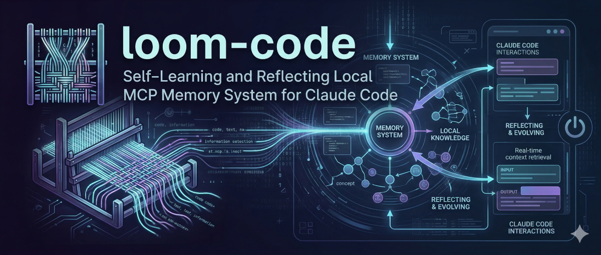

<p align="center">
  
</p>

# loom-code

Persistent memory and self-evolving directives for Claude Code.

Claude Code starts fresh on every conversation. loom-code fixes that. It gives Claude a persistent memory store, a set of coding rules that evolve based on what actually happens in your sessions, and a weekly reflection pipeline that synthesizes patterns and proposes new rules for your approval.

Sessions are remembered. Mistakes become directives. The assistant gets better over time.

---

## Meet Loomy

<p align="center">
  
</p>

Loomy is the resident agent behind loom-code. While you work, Loomy is busy in the background weaving your conversations, code changes, and reflections into a persistent memory fabric.

- **Self-learning:** Loomy watches how you solve problems and surfaces those patterns when they're relevant again.
- **Reflecting:** Loomy reorganizes your local knowledge over time and proposes new rules for your approval.
- **Always local:** Loomy never lets your data leave your machine.

Your identity, directives, and memory all live in `~/.loom-code` — readable plain text, owned by you.

---

## Table of Contents

- [Meet Loomy](#meet-loomy)
- [How It Works](#how-it-works)
- [Architecture: How It All Connects](#architecture-how-it-all-connects)
- [Prerequisites](#prerequisites)
- [Install](#install)
- [Per-Project Setup](#per-project-setup)
- [Companion Plugins](#companion-plugins)
- [The Normal Loop](#the-normal-loop)
- [Key Workflows](#key-workflows)
- [CLI Reference](#cli-reference)
- [MCP Tool Reference](#mcp-tool-reference)
- [Configuration](#configuration)
- [Memory System](#memory-system)
- [Context Budget](#context-budget)
- [File Layout](#file-layout)
- [License](#license)

---

## How It Works

loom-code has four layers that work together:

### Layer 1 — Identity

`~/.loom-code/identity.md` is a short markdown file describing who the assistant is, your preferred working style, and the primary context (languages, projects). You write it once during install. The system never touches it after that. Every session loads it verbatim.

### Layer 2 — Directives

`~/.loom-code/directives/` contains markdown files of coding rules — things like "never defer initialization of expensive resources to first use" or "use factories in tests, never `.objects.create()`". These load at every session start. They start as seeds and evolve through the reflection pipeline.

Three directive scopes:

| File | Scope | Example |
|------|-------|---------|
| `permanent.md` | All projects, all sessions | "No `print()` — use `logger.info()`" |
| `by-domain/python.md` | Python sessions only | "Use `pathlib` over `os.path`" |
| `by-project/myapp.md` | One project | "Always run `docker compose ps` before testing endpoints" |

### Layer 3 — Memory

A SQLite database (`~/.loom-code/db/loom.db`) stores everything: memories, sessions, journals, and directive change proposals. Memories are embedded with `all-MiniLM-L6-v2` (384-dim vectors, runs locally) and retrieved via cosine similarity.

Every memory has a **salience** score (0.0–1.0). High-salience memories (≥ 0.8) surface at session start. Salience grows when a memory is accessed and decays when it goes stale.

### Layer 4 — The Reflect Cycle

`loom-reflect` runs the reflection pipeline, which makes 2–3 LLM calls (using whatever provider you configured during install):

1. **Journal Synthesis** (The Memory Weaver) — reads recent session summaries and writes a narrative journal entry to `~/.loom-code/journals/`
2. **Directive Proposals** (The Critic) — reads sessions + journals + high-salience memories + existing directives → proposes `APPEND:` or `REPLACE:` diffs as pending changes for your review
3. **Memory Reconsolidation** (The Reconsolidator) — finds cross-cutting patterns across memories and creates `reconsolidated_insight` memories that surface globally across all projects
4. **Entropy Decay** — stale memories (not accessed in 14+ days) lose salience at 0.95× per cycle

```
Session start
  │  Claude loads: identity + directives + top-10 high-salience memories
  │
  ▼
During session
  │  Claude: loom_recall before tasks, loom_remember on discoveries
  │  You: paste errors → loom_propose_directive queues rules immediately
  │
  ▼
Session end
  │  Claude: loom_session_end(summary, learnings, surprises)
  │  → session stored in DB + written to ~/.loom-code/sessions/
  │
  ▼  (after 3+ sessions, or when journal_due flag returns true)
loom-reflect
  │  1. Journal Synthesis   → ~/.loom-code/journals/<date>-<project>.md
  │  2. Directive Proposals → pending in DB (shown in loom-approve)
  │  3. Reconsolidation     → new reconsolidated_insight memories
  │  4. Entropy Decay       → stale memories lose salience
  │
  ▼
loom-approve
  │  You review each proposed diff, approve or reject
  │  Approved: written to directive files immediately
  │
  ▼
Next session start
   New rules load automatically — the assistant is measurably better
```

---

## Architecture: How It All Connects

loom-code works across two distinct layers. Understanding where each file lives and who writes it makes the whole system legible — especially when something behaves unexpectedly.

### Layer A — Claude's Native Config (`~/.claude/`)

Claude reads these files automatically. They shape behavior at the protocol level before any MCP tool is called.

| File / Dir | What it is | Written by | Changes how? |
|---|---|---|---|
| `~/.claude/CLAUDE.md` | Behavioral instructions: coding standards, and crucially — **when and how Claude calls loom tools** | You + loom `install.sh` (once) | Manually, or `./install.sh --update` to refresh the loom section |
| `~/.claude/agents/*.md` | Sub-agent definitions — `code-reviewer` (sonnet), `doc-writer` (sonnet), `git-helper` (haiku) | loom `install.sh` | Manually, or via approved directive change targeting the agent file |
| `~/.claude/skills/reflect/SKILL.md` | `/reflect` — interactive reflection + approval flow | loom `install.sh` | Manually, or `./install.sh --update` |
| `~/.claude/skills/loom/SKILL.md` | `/loom` — artifact-driven dev pipeline (spec → decompose → build) | loom `install.sh` | Manually, or `./install.sh --update` |
| `~/.claude/skills/loom-resume/SKILL.md` | `/loom-resume` — re-enter an interrupted loom work session | loom `install.sh` | Manually, or `./install.sh --update` |
| `~/.claude/skills/loom-status/SKILL.md` | `/loom-status` — show progress across all loom work folders | loom `install.sh` | Manually, or `./install.sh --update` |
| `~/.claude/settings.json` | Five global hooks — `SessionStart` (session guard), `PreToolUse` (secrets scanner), `Stop` (session end reminder), `PreCompact` (context snapshot), `SubagentStop` (agent-feedback capture) | loom `install.sh` | Manually only |
| `.claude/settings.json` | Per-project hooks — `PostToolUse` quality checks after Edit/Write | `loom-bootstrap` (once per project) | Manually only |

**CLAUDE.md is the bridge.** It's what tells Claude this memory system exists and how to use it. Without the `## Loom-Code Memory System` section, Claude would never call `loom_session_start` — the hooks, agents, and skills would be invisible. It's static by design: it describes the tool API, which only changes when loom-code itself changes.

### Layer B — loom-code's Data (`~/.loom-code/`)

Claude accesses these through MCP tools. This is the living, evolving knowledge store.

| File / Dir | What it is | Written by | Changes how? |
|---|---|---|---|
| `identity.md` | Who the assistant is — values, working style, primary context | You (once at install) | You edit directly. Never auto-modified. |
| `directives/permanent.md` | Universal coding rules, loaded every session | You + reflect→approve pipeline | loom-approve applies approved diffs |
| `directives/by-domain/*.md` | Domain-specific rules (Python, TypeScript) | You + reflect→approve pipeline | loom-approve applies approved diffs |
| `directives/by-project/*.md` | Per-project rules | You + reflect→approve pipeline | loom-approve applies approved diffs |
| `db/loom.db` | SQLite: memories, sessions, journals, directive proposals | Claude (via MCP tools) + loom-reflect | Continuous — every session |
| `sessions/<project>/` | Session notes written at conversation end | Claude via `loom_session_end` | Every session |
| `journals/` | Narrative synthesis from reflect | `loom-reflect` | After each reflect run |
| `.env` | Provider config (model, API key, name) | install.sh, loom-config | `loom-config --edit` |
| `.active_sessions/` | Sentinel files for session tracking | `loom_session_start` / `loom_session_end` | Each session boundary |

### The Full Data Flow

```
Your prompt arrives
    │
    ├─ SessionStart hook fires once (session-guard.sh reads ~/.loom-code/.active_sessions/)
    │   If no active session → <system-reminder> tells Claude to call loom_session_start
    │
    ├─ Claude reads ~/.claude/CLAUDE.md  [automatic, every conversation]
    │   Contains: your coding standards + Loom-Code Memory System instructions
    │
    ▼
Claude calls loom_session_start(project)
    │   Reads: identity.md + all relevant directive files + top-10 high-salience memories
    │   Drains: pending-captures/ queue → embeds deferred memories from last session
    │   Returns: full context bundle (+ pending_captures_processed count)
    │   Writes: .active_sessions/<project> sentinel file
    │
    ▼
Claude works on your task
    │
    ├─ Before any significant task:
    │   loom_recall(query)  →  semantic search over SQLite  →  top-5 relevant memories
    │
    ├─ If switching domains mid-session (e.g., Python after TypeScript):
    │   loom_directives(domain="python")  →  loads domain rules into current context
    │
    ├─ On pattern or constraint discovery:
    │   loom_remember(content, memory_type, salience)  →  embed + store in SQLite
    │
    ├─ On mistake worth encoding immediately:
    │   loom_propose_directive(rule, reasoning, file)
    │       → semantic dedup check (cosine ≥ 0.82 against existing rules)
    │       → if no duplicate: queued in DB as pending proposal
    │
    ├─ Before every Write/Edit  [global, always]:
    │   PreToolUse hook fires  →  secrets-check.sh  →  scans content for credential patterns
    │   If pattern matched → write is BLOCKED with explanation
    │
    ├─ After every Edit/Write  [if loom-bootstrap was run on this project]:
    │   PostToolUse hook fires  →  quality-check.sh  →  ruff / tsc / eslint
    │   Violations printed to stdout  →  Claude reads and fixes in same turn
    │
    ├─ After each Claude turn  [global, always]:
    │   Stop hook fires  →  session-timeout-check.sh
    │   If session > 45min old with no loom_session_end  →  reminder emitted
    │
    ├─ Before context window compression  [global, if context fills]:
    │   PreCompact hook fires  →  pre-compact-snapshot.py
    │   Extracts last 3 user messages as working context snapshot
    │   Writes: ~/.loom-code/pending-captures/<ts>-precompact.json
    │   (processed at next loom_session_start — no cold-load in the hook)
    │
    ├─ When a subagent finishes  [global, always]:
    │   SubagentStop hook fires  →  subagent-stop-capture.py
    │   Scans output for <!-- agent-feedback: agent-name: content -->
    │   Matching entries → ~/.loom-code/pending-captures/<ts>-agentfeedback.json
    │   (processed at next loom_session_start)
    │
    ▼
Conversation ends (or user says bye / done / thanks / gtg)
Claude calls loom_session_end(summary, learnings, surprises)
    │   Writes: session notes to ~/.loom-code/sessions/<project>/<date>_slug.md
    │   Writes: session record to SQLite
    │   Removes: .active_sessions/<project> sentinel
    │   Returns: journal_due flag
    │
    ▼  (manually — when journal_due or after 3+ sessions)
loom-reflect
    │   1. Memory Weaver:    sessions → narrative journal entry
    │   2. The Critic:       sessions + journal + memories + directives → APPEND:/REPLACE: proposals
    │   3. Reconsolidator:   cross-project patterns → reconsolidated_insight memories
    │   4. Entropy Decay:    memories not accessed in 14+ days → salience × 0.95
    │
    ▼
loom-approve
    │   You review each proposal (exact diff shown with source evidence)
    │   Approved → apply_directive_diff writes to ~/.loom-code/directives/
    │   If target is an agent or skill file:
    │       → also writes to ~/.claude/agents/ or ~/.claude/skills/  (active immediately)
    │       → also writes to LOOM_SRC_PATH/assets/  (survives reinstall)
    │
    ▼
Next session start
    Updated rules load automatically
```

### What's Stable vs What Evolves

| | Never auto-modified | Evolves automatically | Modified on reinstall |
|---|---|---|---|
| **Claude native** | `CLAUDE.md` (after install), hooks config | Agent/skill files (via approved directive changes) | Agents, skills, CLAUDE.md loom section |
| **loom-code data** | `identity.md`, `.env` | Directives, memories, sessions, journals | — |

The key design rule: **CLAUDE.md describes the protocol, directives carry the rules.** The protocol changes rarely (when tool APIs change). The rules change often (every reflect cycle). Keeping them separate means Claude always knows *how* to use the system, even as *what* the system knows evolves.

---

## Prerequisites

- **Claude Code** installed and authenticated (`claude` in `$PATH`)
- **Python 3.12+**
- An LLM for reflection: Anthropic API key, a running Ollama instance, or any OpenAI-compatible endpoint

---

## Install

### Quick install

```bash
curl -fsSL https://raw.githubusercontent.com/rhatigan-agi/loom-code/main/install.sh | bash
```

### Manual install

```bash
git clone https://github.com/rhatigan-agi/loom-code.git ~/.local/share/loom-code
cd ~/.local/share/loom-code
./install.sh
```

The installer:
1. Creates `~/.loom-code/` directory tree
2. Creates a Python 3.12 virtual environment at `~/.loom-code/.venv/`
3. Installs loom-code as an editable package (git pull = instant update)
4. Runs a config wizard (your name, reflection provider)
5. Downloads `all-MiniLM-L6-v2` embedding model to `~/.loom-code/.model-cache/`
6. Initializes the SQLite database
7. Seeds `identity.md` and `directives/permanent.md` from templates
8. Registers the MCP server with Claude Code at user scope
9. Installs skills (`/reflect`, `/loom`, `/loom-resume`, `/loom-status`) and built-in agents to `~/.claude/`
10. Adds shell aliases to `~/.bashrc` and `~/.zshrc`
11. Registers five global hooks: `SessionStart` (session guard), `PreToolUse` (secrets scanner), `Stop` (session end reminder), `PreCompact` (context snapshot), `SubagentStop` (agent-feedback capture)
12. Injects the loom-code usage instructions into `~/.claude/CLAUDE.md`
13. Optionally installs a status line script (`~/.claude/statusline.sh`) showing project name, model, and a color-coded context window bar in the Claude Code status bar (bar shifts amber at 75% and red at 90%)

After install, source your shell and restart Claude Code:

```bash
source ~/.bashrc   # or ~/.zshrc
# restart Claude Code
```

### Reflection provider options

| Choice | Provider | Notes |
|--------|----------|-------|
| 1 | Anthropic API | `claude-haiku-4-5-20251101` — recommended, fast, cheap |
| 2 | Ollama | Local, no key needed, `qwen3:8b` default |
| 3 | OpenAI-compatible | Any endpoint + key + model name |

Config lives in `~/.loom-code/.env`. Use `loom-config` to change it later.

### Update

```bash
cd ~/.local/share/loom-code
git pull
./install.sh --update
```

`--update` skips the config wizard, re-uses your existing `.env`, and refreshes aliases, skills, agents, the status line script (if installed), and the CLAUDE.md snippet.

---

## Per-Project Setup

Run this once from any project root to wire quality hooks into `.claude/settings.json`:

```bash
cd ~/your-project
loom-bootstrap
```

This creates two files:

- **`.claude/settings.json`** — the `PostToolUse` hook that runs after every Edit/Write, automatically linting changed files with `ruff` (Python), `tsc --noEmit` (TypeScript), or `eslint` (JavaScript). Violations are printed to stdout for Claude to read and fix in the same turn.
- **`.claude/settings.local.json`** — an empty `{}` stub required by Claude Code. Without it, Claude Code reports "invalid settings file" and ignores the hooks.

`loom-bootstrap` is **per-project** and optional. The MCP server itself is registered globally and works in every project automatically.

---

## Companion Plugins

Standard Claude Code plugins — not part of loom-code, but they complement the `PostToolUse` quality hook by providing **inline diagnostics during the edit sequence** (same turn, before the hook fires).

The installer offers to install them automatically. To install manually from terminal:

```bash
claude plugin install pyright-lsp@anthropics/claude-code --scope user    # Python
claude plugin install typescript-lsp@anthropics/claude-code --scope user  # TypeScript
```

Or from inside a Claude Code session:

```
/plugin install pyright-lsp@anthropics/claude-code
/plugin install typescript-lsp@anthropics/claude-code
```

| Plugin | Effect |
|--------|--------|
| `pyright-lsp` | Python type errors and missing imports surfaced inline mid-edit |
| `typescript-lsp` | TypeScript type errors surfaced inline mid-edit |

**Difference from quality-check.sh**: the PostToolUse hook runs after Claude finishes editing (reactive — catches violations in the next turn). LSP plugins run during the edit sequence (proactive — same turn, before Claude is done). Both are optional and complementary.

---

## The Normal Loop

### What Claude does automatically

Claude handles the session lifecycle without you asking:

| Event | Claude action |
|-------|---------------|
| Conversation starts | `loom_session_start(project)` — loads identity, directives, recent context |
| Before any significant task | `loom_recall(query)` — searches memories for relevant past solutions |
| Discovers a pattern or constraint | `loom_remember(content, memory_type)` |
| Conversation ends / user says bye | `loom_session_end(summary, learnings, surprises)` |
| Observes a mistake mid-session | `loom_propose_directive(rule, reasoning)` — queues immediately |

### What you do manually

| When | Command |
|------|---------|
| After 3+ sessions (or when prompted) | `loom-reflect` |
| After reflect produces proposals | `loom-approve` |
| Want a health check | `loom-stats` |
| Starting a new project | `loom-bootstrap` (once per project) |
| Want to tweak config | `loom-config` |

---

## Key Workflows

### Artifact-driven development with `/loom`

`/loom` is the primary way to start any non-trivial task. It routes by complexity and produces persistent artifacts before writing any code — giving Claude stable working memory across sessions and giving you an auditable record of decisions.

```
/loom add Stripe webhook handling for subscription events
/loom implement the user notification preferences feature
/loom <paste a GitHub issue directly>
```

**How routing works:**

| Tier | Signal | What happens |
|------|--------|--------------|
| **Trivial** | Tightly scoped, low ambiguity, low coordination cost, reversible | One-line summary, begin immediately, no artifacts |
| **Moderate** | Clear requirements, bounded file set (~2–8 files) | Enters planning mode → spec + task list → approval → build |
| **Substantial** | Ambiguous, multi-day, pasted issue, cross-cutting concerns | Enters planning mode → spec (with inline critic pass) + rich subtask breakdown → approval → build |

**For moderate and substantial tasks**, `/loom` creates a work folder in `.loom/work/<timestamp-slug>/`:

```
.loom/
  README.md              ← attribution (created once)
  active                 ← current slug
  work/
    20260318-stripe-webhook/
      spec.md            ← problem statement, acceptance criteria, constraints, non-goals, assumptions
      plan.md            ← ordered tasks (moderate) or rich subtasks with interfaces + proof (substantial)
      status.md          ← phase, classification, checklist, blocked items
      decisions.md       ← append-only ADR log (substantial only)
```

`spec.md` and `plan.md` are written before any code is touched — locked in during the planning mode approval step. `status.md` is updated after each completed subtask.

**Re-entry on day 2 (or after any interruption):**

```
/loom-resume             ← resumes the active folder, or the only incomplete one, or asks you to choose
/loom-status             ← read-only view of all work folders and their progress
```

**The `.loom/` folder** is not gitignored by default. Teams can commit it as a collaborative artifact (plan is visible to reviewers) or gitignore it as a local scratchpad — your call.

---

### Turning an error into a permanent rule

The most common pattern: you paste a test failure or stack trace, Claude diagnoses it, and you want that mistake encoded so it never happens again.

**Step 1 — Paste the error.** Claude reads it, identifies the root cause.

**Step 2 — Claude calls `loom_propose_directive`.** This queues an immediate directive proposal without waiting for the weekly reflect cycle:

```
loom_propose_directive(
  content  = "Never call db.execute() outside a connection context manager — "
             "causes 'database is locked' errors under concurrent load",
  reasoning = "Caused by missing `with get_connection() as conn:` wrapper — "
              "seen in test_concurrent_writes failure (March 2026)",
  file     = "by-project/myapp.md"   # or "permanent.md" for universal rules
)
```

**Step 3 — Semantic dedup runs automatically.** Before queuing, loom-code embeds the proposed rule and compares it against every existing bullet in the target file. If a semantically similar rule already exists (cosine similarity ≥ 0.82), the proposal is skipped and the existing rule is shown instead. No duplicate bloat.

**Step 4 — You run `loom-approve`.** Review the diff, approve it. The rule writes to the directive file immediately.

**Step 5 — Next session start.** The rule loads automatically. Claude knows never to make that mistake again.

Claude also stores the error as a high-salience memory for the reflection pipeline:

```
loom_remember(
  content     = "..error description..",
  memory_type = "mistake",
  salience    = 0.85   # ensures The Critic sees it prominently at reflect time
)
```

### Weekly reflection

Run after a few sessions of work:

```bash
loom-reflect                       # all projects, last 7 days
loom-reflect --days 14             # look back further
loom-reflect --project myapp       # one project only
loom-reflect --mode journal        # synthesis only, no directive proposals
loom-reflect --mode directives     # proposals only, no journal
```

Or use `/reflect` inside Claude Code for an interactive flow — Claude runs the pipeline and walks you through each proposal inline.

After reflect:

```bash
loom-approve              # review all pending proposals
loom-approve --all        # approve everything (trust The Critic)
loom-approve --reject-all # reject everything
loom-approve <id> approve # approve a single proposal by ID
```

Each proposal shows: target file, change type, the exact diff to apply, and the evidence used to generate it.

---

## CLI Reference

| Command | Description |
|---------|-------------|
| `loom-install` | Re-run the installer. Use `--update` to skip wizard and refresh aliases/skills. |
| `loom-bootstrap` | One-time per-project setup: creates `.claude/settings.json` with PostToolUse quality hooks. Auto-detects language (Python → ruff, TypeScript → tsc, JS → eslint); safe to run on any project. |
| `loom-config` | View or edit `~/.loom-code/.env` interactively. |
| `loom-reflect` | Run the Reflect Cycle: journal synthesis, directive proposals, reconsolidation, entropy decay. |
| `loom-approve` | Review and approve or reject pending directive proposals. |
| `loom-stats` | Show memory counts, salience distribution, session history, and directive file sizes. |
| `loom-test` | Run the loom-code test suite. Dev use only — not needed for normal operation. |

### loom-config

```bash
loom-config                        # show current config (API key masked)
loom-config --edit                 # interactive field-by-field editor
loom-config --set LOOM_REFLECTION_MODEL qwen3:8b   # set a single key
```

Editable fields: `LOOM_USER_NAME`, `LOOM_REFLECTION_MODEL`, `LOOM_REFLECTION_BASE_URL`, `LOOM_REFLECTION_API_KEY`.

### loom-stats

```
{
  "total_memories": 499,
  "high_salience_memories": 180,
  "avg_salience": 0.726,
  "by_type": { "reconsolidated_insight": 150, "pattern": 97, ... },
  ...
}

── Directive Files ──────────────────────────────────────
  File                                 Bullets  Est. Tokens
  ───────────────────────────────────  ───────  ───────────
  permanent.md                              27         1292
  by-project/myapp.md                       22         1838
  ───────────────────────────────────  ───────  ───────────
  TOTAL                                                3130
```

Directive files over 2000 estimated tokens get a `[!]` warning — signal to run `loom-reflect` so The Critic can consolidate.

---

## MCP Tool Reference

These are the tools Claude calls directly via the MCP server. You don't invoke them — Claude does. Listed here so you understand what's happening.

| Tool | When Claude calls it | Key params |
|------|---------------------|------------|
| `loom_session_start(project)` | First thing, every conversation | `project`: repo name or `basename $PWD` |
| `loom_session_end(summary, learnings, surprises)` | Conversation wraps up | `learnings`: list of strings for The Critic |
| `loom_recall(query)` | Before any significant task, or when stuck | `query`: natural language description of task |
| `loom_remember(content, memory_type, salience)` | On discoveries, patterns, constraints, mistakes | `salience=0.85` for hard-won lessons |
| `loom_propose_directive(content, reasoning, file)` | After diagnosing a mistake worth encoding | `file`: target directive path |
| `loom_directives(domain, project)` | When switching domains mid-session or when domain/project rules weren't loaded at session start | `domain`: `python`, `typescript`, etc.; `project`: repo name |
| `loom_reflect(days, project, mode, auto_approve)` | Via `/reflect` skill or manually | `mode`: `full`, `journal`, `directives` |
| `loom_approve(change_id, decision)` | Via `/reflect` skill | `decision`: `approve` or `reject` |
| `loom_status()` | Health check | Returns memory stats + active sessions |

### memory_type values for `loom_remember`

| Type | Use for |
|------|---------|
| `pattern` | Recurring patterns, architectural conventions |
| `mistake` | Errors made — use `salience=0.85` |
| `decision` | Architectural or design decisions |
| `insight` | Discoveries, non-obvious findings |
| `workflow` | Environment constraints, tool limitations, repeated corrections |
| `indexed` | General knowledge |
| `agent_feedback` | Sub-agent observations — captured for The Critic via `<!-- agent-feedback: ... -->` comments |

---

## Configuration

All config lives in `~/.loom-code/.env`. Set during install, editable via `loom-config`:

```bash
LOOM_USER_NAME=Jeff
LOOM_REFLECTION_MODEL=claude-haiku-4-5-20251101   # default model for all reflect steps
LOOM_REFLECTION_BASE_URL=https://api.anthropic.com
LOOM_REFLECTION_API_KEY=sk-ant-...
LOOM_SRC_PATH=/path/to/loom-code   # set by installer, don't change manually

# Optional: per-step model overrides (all default to LOOM_REFLECTION_MODEL)
# LOOM_CRITIC_MODEL=claude-sonnet-4-5-20251101     # The Critic (directive proposals)
# LOOM_WEAVER_MODEL=claude-haiku-4-5-20251101      # The Memory Weaver (journal synthesis)
# LOOM_RECONSOLIDATION_MODEL=claude-haiku-4-5-20251101  # Reconsolidator (cross-project insights)
```

The Critic (directive proposals) is the highest-judgment step — it's worth routing to a stronger model if you want better proposals. The Weaver and Reconsolidator are cheaper to run on a lighter model.

Any model string is accepted: Anthropic model IDs, Ollama model names (`qwen3:8b`), or any OpenAI-compatible model. Each step uses `LOOM_REFLECTION_BASE_URL` and `LOOM_REFLECTION_API_KEY` regardless of which model is set.

### Customizing identity

Edit `~/.loom-code/identity.md` directly. This is your assistant's "genome" — it loads at every session and defines who they are, what you value, and the primary working context. The system never modifies it.

```markdown
# Identity

## Who I Am
I am Jeff's development assistant, Loomy. Powered by Claude Code with persistent memory via loom-code.

## Core Values
- Directness over diplomacy
- Working code over documentation
- Earned complexity (simple until proven insufficient)

## Working Style
- [fill in preferred interaction patterns]

## Primary Context
- Languages: Python, TypeScript
- Projects: [fill in active projects]
```

### Customizing directives

Edit `~/.loom-code/directives/permanent.md` directly for universal rules. Create `~/.loom-code/directives/by-project/myapp.md` for project-specific rules. The reflection pipeline will also propose changes to these files — you review and approve before anything is written.

---

## Memory System

### Salience

Every memory has a salience score from 0.0 to 1.0 controlling how prominently it surfaces:

| Score | Meaning |
|-------|---------|
| 0.85+ | High priority — mistakes, hard-won lessons. Load at session start. |
| 0.7 | Reconsolidated insights (set by system). |
| 0.65 | Journal entries (set by system). |
| 0.5 | Default for new memories. |
| < 0.25 | Archive candidate — effectively inactive. |

Session start loads the top 10 memories with salience ≥ 0.8. This is a hard cap — no matter how many memories you have, only 10 surface per session.

### Near-duplicate deduplication

When storing a new memory, loom-code checks all existing memories of the same type for cosine similarity ≥ 0.95. Near-duplicates reinforce the existing memory (bumping its salience by +0.05) rather than creating a new record.

### Decay

Memories not accessed in 14+ days lose salience at 0.95× per reflect cycle. `reconsolidated_insight` memories are immune for 30 days after creation.

A memory at salience 0.5 needs roughly 19 decay cycles (~38 weeks of inactivity at weekly reflect) to drop below the 0.25 archive threshold. Memories you actively use never decay — each retrieval via `loom_recall` reinforces them.

### Reconsolidation

The Reconsolidator step in `loom-reflect` finds cross-cutting patterns across high-salience memories that aren't obvious from individual entries. These are stored as `reconsolidated_insight` memories with `project=null` — meaning they appear in **every** project's session context. They represent the deepest learned knowledge.

---

## Context Budget

Directive files load verbatim at session start. Monitor with `loom-stats`:

- **Under 1500 tokens per file**: healthy
- **1500–2000 tokens**: watch closely
- **Over 2000 tokens (`[!]` warning)**: run `loom-reflect` — The Critic will propose a consolidation

When `permanent.md` has more than 60 bullet rules, The Critic is automatically prompted to look for consolidation opportunities and propose a `REPLACE:` diff with a streamlined version. You review and approve it like any other proposal.

Before proposing, `loom_propose_directive` also runs a semantic similarity check against existing rules (cosine ≥ 0.82 = skip). This prevents directive bloat from rephrased versions of existing rules.

---

## File Layout

```
~/.loom-code/
├── .env                        # Provider config (chmod 600)
├── identity.md                 # Assistant identity — you edit this once
├── directives/
│   ├── permanent.md            # Universal rules — evolve via reflect+approve
│   ├── by-domain/
│   │   ├── python.md           # Python-session rules
│   │   └── typescript.md       # TypeScript-session rules
│   └── by-project/
│       └── <project>.md        # Per-project rules
├── sessions/
│   └── <project>/
│       └── <date>_<slug>.md    # Session notes written at conversation end
├── journals/
│   └── <date>-<project>.md     # Synthesized journal entries from reflect
├── db/
│   └── loom.db                 # SQLite: memories, sessions, journals, proposals
├── .active_sessions/           # Sentinel files: created by session_start, removed by session_end
├── pending-captures/           # Transient queue: hooks write here, session_start drains + embeds
├── .model-cache/               # all-MiniLM-L6-v2 embedding model (local)
├── .venv/                      # Python venv (managed by install.sh)
└── scripts/
    ├── session-guard.sh        # SessionStart hook (session start reminder)
    ├── secrets-check.sh        # PreToolUse hook (credential pattern scanner)
    ├── session-timeout-check.sh # Stop hook (session end reminder)
    ├── pre-compact-snapshot.sh  # PreCompact hook wrapper
    ├── pre-compact-snapshot.py  # Captures working context before compaction
    ├── subagent-stop-capture.sh # SubagentStop hook wrapper
    ├── subagent-stop-capture.py # Captures agent-feedback comments from subagent output
    └── quality-check.sh        # PostToolUse hook (ruff/tsc/eslint — installed by loom-bootstrap)

~/.claude/
├── statusline.sh              # Status bar script (optional — installed by install.sh)
└── ...                        # settings.json, agents/, skills/ (managed by install.sh)
```

---

## License

MIT — see [LICENSE](LICENSE).

Built by [Jeff Rhatigan](https://github.com/rhatigan-agi). If you're using loom-code, open an issue to say hi — especially if you're at an interesting org. I'd genuinely like to know.
